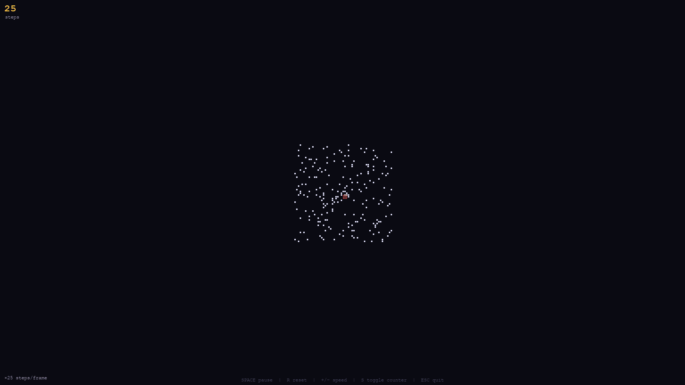

# 🐜 Langton's Ant

A real-time visualiser for one of computer science's most surprising emergent systems — built with Python and Pygame.


---

## Demo



---

## How it works

An ant lives on an infinite grid of black and white cells and follows exactly two rules:

- **On a white cell** — turn right, flip the cell to black, move forward one step
- **On a black cell** — turn left, flip the cell to white, move forward one step

That is the entire system. What makes it remarkable is what happens over time:

1. **Early steps** — the ant produces what looks like complete chaos, wandering with no discernible structure
2. **Around 10,000 steps** — with no warning, it spontaneously begins constructing a perfectly regular diagonal corridor called the **highway**, and continues indefinitely

The exact step at which the highway emerges varies each run depending on the random starting conditions. Nobody has formally proved *why* the highway emerges at all, let alone *when* — it has been observed in every simulation ever run, but a mathematical explanation remains an open problem.

Highway detection is implemented by tracking displacement vectors over the repeating 104-step period. Once five consecutive periods produce identical displacements, the highway is confirmed and the visualiser transitions the cell colour from white to cyan.

---

## Prerequisites

- [uv](https://docs.astral.sh/uv/) — Python version and package manager

Install `uv` once (run this in PowerShell):

```powershell
powershell -c "irm https://astral.sh/uv/install.ps1 | iex"
```

---

## Installation and setup

```bash
git clone https://github.com/GrahlmanMatthew/Langtons-Ant.git
cd Langtons-Ant
uv venv
uv pip install -e .
```

Set up pre-commit hooks:

```bash
pip install pre-commit
pre-commit install
pre-commit install --hook-type commit-msg
detect-secrets scan > .secrets.baseline
git add .secrets.baseline
```

---

## Usage

```bash
uv run langtons-ant
```

| Key | Action |
| --- | --- |
| `SPACE` | Pause / resume |
| `R` | Reset with new random starting conditions |
| `+` / `=` | Speed up |
| `-` | Slow down |
| `S` | Toggle step counter |
| `ESC` / `Q` | Quit |

---

## Configuration

All parameters can be overridden via environment variables. Copy `.env.example` to `.env` and edit as needed.

| Variable | Default | Description |
| --- | --- | --- |
| `TARGET_FPS` | `60` | Render framerate cap |
| `STEPS_PER_FRAME` | `10` | Ant steps per rendered frame (starting speed) |
| `SPEED_STEP` | `5` | How much `+`/`-` changes steps per frame |
| `MAX_SPF` | `500` | Maximum steps per frame |
| `MIN_SPF` | `1` | Minimum steps per frame |
| `NUM_NOISE_CELLS` | `200` | Random cells pre-flipped on each reset |
| `NOISE_SPREAD_DIVISOR` | `8` | Controls noise radius: `min(w,h) ÷ (CELL_SIZE × divisor)` |
| `RANDOM_DIRECTIONS` | `true` | Randomise ant's starting direction on reset |

`CELL_SIZE` (pixels per grid cell, default `5`) is a fixed constant in `src/langtons_ant/config/constants.py`.

---

## Running the tests

```bash
uv pip install -e ".[dev]"
pytest
```

---

© 2025 Matthew E. Grahlman. All rights reserved.
